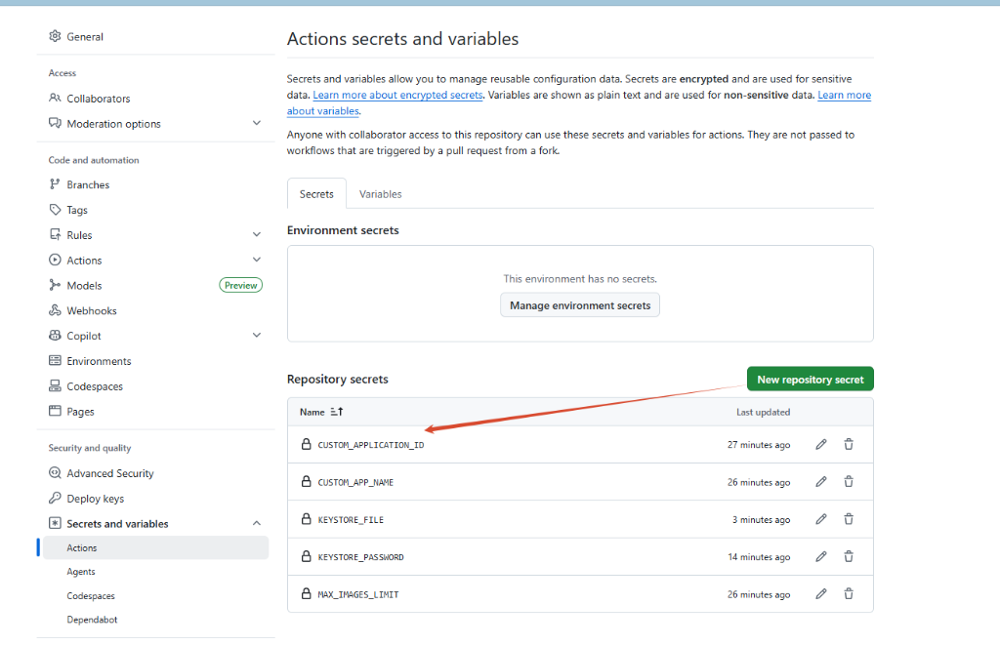

# **🚀 MoshidonQX 定制构建指南**

本仓库是基于 Moshidon（Mastodon 高值颜客户端）的个性化定制与性能优化分支，专为 GoToSocial/Mastodon 用户打造。

它支持**自定义应用名称**、**独立包名（实现分身共存）**、**破解多图上传数量限制**以及**流畅的视频播放引擎**。

任何人只需 Fork 本项目，即可直接在线编译出专属的个性化 APK！

---

## **⚙️ 配置参数说明**

你可以自定义以下三个核心参数：
1. **应用包名 (Package Name / Application ID)**：决定了应用在手机底层的唯一标识。通过将其设为独特的值（如带有 `.qx` 尾缀），**可以让此定制版与您手机里的原版 Moshidon 完美共存，互不覆盖**。
2. **应用名称 (App Name)**：手机桌面上图标下方显示的软件名称（支持中文）。
3. **最大图片上传数量限制 (Max Images Limit)**：突破原生 4 张图的限制，允许一次性选择并上传多张图片（默认 12 张）。

### **参数配置优先级**
这三个参数支持以下三级配置，系统会按照优先级自动读取：
1. **GitHub 运行输入**：在 Actions 页面手动点击 **Run workflow** 构建时直接填写的参数（临时生效，优先级最高）。
2. **GitHub 仓库变量**：在仓库 **Settings -> Secrets and variables -> Actions -> Variables** 下添加的全局变量：`CUSTOM_APPLICATION_ID`、`CUSTOM_APP_NAME`、`MAX_IMAGES_LIMIT`（长期生效）。
3. **本地配置文件**：直接修改项目根目录下的 [config.properties](file:///e:/temp/moshidon/config.properties) 文件（长期生效）。

---

## **🛠️ 极速构建指南**

### **第一步：Fork 本仓库**
点击本仓库右上角的 **Fork** 按钮，复制一份完整的代码到您的个人 GitHub 账号下。

### **第二步：选择您的工作流并触发构建**

本项目为您设计了**两个完全独立的工作流**，分别满足您的日常测试与正式发布需求：

#### **1. 🛠️ 开发测试流：`Build MoshidonQX (Dev 测试版)`**
* **特点**：编译极其迅速，**不需要任何证书签名配置**。
* **日志支持**：此测试版内部已激活崩溃日志捕获系统，闪退时会自动在手机 `/内部存储/Android/data/<您的包名>.debug/files/crashes/` 目录下生成 `.txt` 崩溃报告，极其便于排错！
* **编译包名**：已自动启用 `.debug` 包名后缀，可与您手机里的正式版客户端完美共存。
* **操作步骤**：
  1. 进入 Actions 页签，在左侧选择 `Build MoshidonQX (Dev 测试版)`。
  2. 点击右侧 **Run workflow**（可选择输入临时定制参数，不输则自动取上述配置变量），启动构建。
  3. 运行完成后，点击该次构建记录，直接拉到页面最底部，在 **Artifacts** 区域直接下载 **`MoshidonQX-Debug-Dev-APK`** 即可。

#### **2. 💎 生产发布流：`Build MoshidonQX (Prod 正式签名版)`**
* **特点**：正式的包名（无 `.debug` 后缀）。此生产正式版已关闭崩溃日志本地写入以节省空间，极致稳定纯净。
* **发布方式**：自动使用您的专属签名证书对 APK 进行加密签名，并发布至 **Releases** 页面，方便您和朋友安装。
* **如何获取并配置专属签名证书（仅需 1 分钟，终身受益）：**
  
  为了保证您后续每次更新都能**无缝覆盖升级安装**（无需卸载旧版），推荐使用我们内置的**一键证书生成器**配置一次：

  ##### **第 ① 步：生成您的专属证书**
  1. 进入仓库的 **Actions** 页签。
  2. 在左侧选择 **`Generate Custom Keystore (小白证书生成器)`**。
  3. 点击右侧的 **Run workflow**，在弹出的窗口中**输入一个您自己记得住的密码**（例如：`mysecret123`），然后点击绿色的 **Run workflow** 按钮启动。
  4. 运行完成后（大约 10 秒），点击进入这一次的构建记录。
  5. 展开 **`Generate Keystore and Base64`** 步骤的运行日志：
     - 找到 **`🔑 您的证书密码`** 这一行，复制出后面的密码。
     - 找到 **`📦 您的证书文本`** 下方，复制出 `START OF BASE64` 和 `END OF BASE64` 两条横线之间的那一大串**整行密密麻麻的乱码文本**。

  ##### **第 ② 步：配置到 GitHub 密钥中（绝对隐私安全）**
  1. 前往您仓库顶部的 **Settings** 页面。
  2. 在左侧菜单中展开 **Secrets and variables**，点击 **Actions**。
  3. 点击右上角的 **New repository secret** 按钮，分别添加以下两个密钥：
     - 🔑 **第一个密钥**：
       - Name 填写：`KEYSTORE_PASSWORD`
       - Secret 填写：您在日志里复制的**证书密码**。
     - 🔑 **第二个密钥**：
       - Name 填写：`KEYSTORE_FILE`
       - Secret 填写：您在日志里复制的那一整行**乱码文本**。

  *(参考配置截图如下，您可以核对您配置的名称和密钥列表是否完全一致)*：
  

  *(注：如果您实在太懒，不想做上述配置，我们依然为您准备了 **【私密自动签名保底机制】**：直接运行构建，系统会自动将证书生成并存放在 GitHub 官方的私有缓存中。但如果 7 天内您未进行任何构建，缓存可能会被 GitHub 清理，下次构建时需重新覆盖安装。因此强烈推荐花 1 分钟完成上述配置！)*

* **操作步骤**：
  1. 完成上述一键配置后，进入 **Actions** 页签，选择 **`Build MoshidonQX (Prod 正式签名版)`**。
  2. 点击 **Run workflow**（可选择输入临时定制参数）并启动构建。
  3. 编译完成后，直接前往您仓库的 **Releases** 页面，下载打包好的专属正式版 APK 即可！

---

## **💖 致谢与致敬项目 (Credits & Acknowledgments)**

本项目的顺利完成离不开以下优秀开源项目的启发与奠基，在此表示衷心的感谢与敬意：

* **Moshidon** (by LucasGGamerM) - 优秀的 Mastodon 高颜值 Android 客户端：[GitHub - LucasGGamerM/moshidon](https://github.com/LucasGGamerM/moshidon)
* **Megalodon** (by sk22) - 极具开创性的 Mastodon 分支客户端：[GitHub - sk22/megalodon](https://github.com/sk22/megalodon)
* **Mastodon Android App** (by Mastodon Core Team) - 官方原生 Android 客户端：[GitHub - mastodon/mastodon-android](https://github.com/mastodon/mastodon-android)
