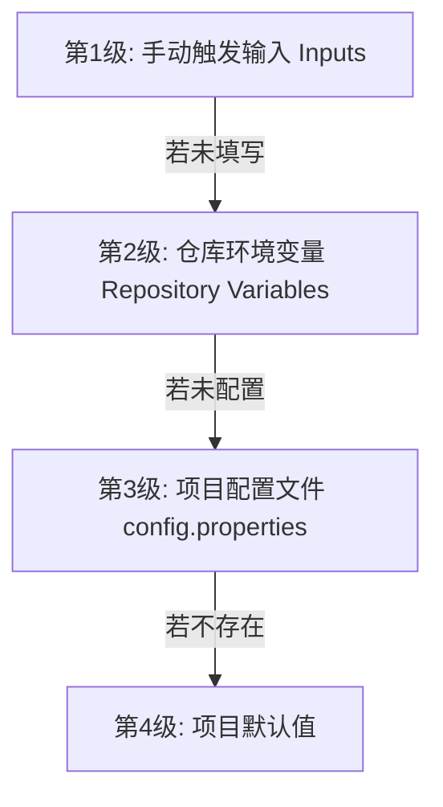

# **🚀 MoshidonQX 极简自动化定制构建手册**

本仓库是基于 Moshidon（Mastodon 高颜值客户端）的深度定制与性能优化分支，专为 GoToSocial/Mastodon 用户打造。

我们为您对视频播放引擎进行了**工业级的生命周期重构**，引入了**真机自诊断崩溃日志系统**，并重新设计了**全自动的“编译期动态配置”架构**。任何人只需 Fork 本项目，即可无需改动任何 Java 代码，直接在线编译出专属的个性化 APK！

---

## **✨ 重大技术升级**

1. **🎬 超丝滑原生视频播放引擎 (Jetpack Media3 ExoPlayer)**：
   * 彻底替换了原生卡顿且消耗内存的旧版 `MediaPlayer`，全面升级为 Google 官方推荐的高性能 `ExoPlayer`。
   * 重构了 `ViewPager2` 滑动切换时的播放器生命周期，自动暂停后台非活跃页面的视频，**杜绝声音重合与后台电量消耗**。
   * 支持 Surface 渲染表面物理安全销毁、视频播放结束一键手势自动回弹重播，带来极致丝滑的视频与 GIFV 播放体验。
2. **🛡️ 真机崩溃自诊断系统 (Crash Log Generator)**：
   * 集成了全局未捕获异常拦截器。应用一旦发生任何运行时闪退，会瞬间生成带有系统环境、版本号和精准代码堆栈的报告。
   * 崩溃日志会自动保存到手机的免权限公开目录中：`/内部存储/Android/data/<您的包名>.debug/files/crashes/`。
   * 开发者无需电脑，直接读取该 `.txt` 日志即可精准锁定任何闪退根源，保障应用绝对的高可维护性。
3. **📦 统一的“编译期动态配置”架构**：
   * 全面弃用了脆弱易错的 `sed` 文本正则替换脚本。
   * 包名变更、应用名称覆盖、多图限制破解全面通过 Gradle 编译期占位符与 `BuildConfig` 常量自动绑定，干净优雅。

---

## **⚙️ 三级参数配置规则（按优先级排序）**

您可以自定义以下三个核心参数：
* **应用包名 (Package Name / Application ID)**：决定了应用在手机底层的唯一标识。通过将其设为独特的值（如带有 `.qx` 尾缀），**可以让此定制版与您手机里的原版 Moshidon 完美共存，互不覆盖**。
* **应用名称 (App Name)**：手机桌面上图标下方显示的软件名称（支持中文）。
* **最大图片上传数量限制 (Max Images Limit)**：破解 Mastodon 原生 4 张图的瓶颈，允许一次性选择并上传多张图片。

为了提供最弹性的定制体验，这三个参数支持以下**三级配置链**，系统会按照优先级自动读取：



### **1. 第一级：手动触发输入（优先级最高 🌟）**
当您在 GitHub 的 **Actions** 页面手动点击 **Run workflow** 触发构建时，可以在弹出的输入框中直接填写您本次想要编译的临时参数。若留空则自动向下寻找。

### **2. 第二级：仓库环境变量（优先级次之 💎）**
如果您希望固定您的个性化配置，免去每次手动输入的麻烦，您可以前往您 Fork 的个人仓库：
👉 **Settings -> Secrets and variables -> Actions -> Variables** 页签下，添加以下三个 **Repository variables**：

| 变量名称 (Name) | 说明 (Description) | 示例值 (Example) |
| :--- | :--- | :--- |
| `CUSTOM_APPLICATION_ID` | 个性化包名 | `org.joinmastodon.android.qx` |
| `CUSTOM_APP_NAME` | 手机桌面显示的应用名 | `MoshidonQX` |
| `MAX_IMAGES_LIMIT` | 一次性上传图片张数上限 | `12` |

### **3. 第三级：项目属性配置文件（优先级第三 📁）**
您也可以直接修改项目根目录下的 [config.properties](file:///e:/temp/moshidon/config.properties) 文件，提交并推送到您的 master 分支。这也是最直观的 fork 友好配置方案。
```properties
custom_application_id=org.joinmastodon.android.qx
custom_app_name=MoshidonQX
max_images_limit=12
```

---

## **🛠️ 极速构建指南**

### **第一步：Fork 本仓库**
点击本仓库右上角的 **Fork** 按钮，复制一份完整的代码到您的个人 GitHub 账号下。

### **第二步：选择您的工作流并触发构建**

本项目为您设计了**两个完全独立的工作流**，分别满足您的日常测试与生产发布需求：

#### **1. 🛠️ 开发测试流：`Build MoshidonQX (Dev 测试版)`**
* **特点**：编译极其迅速，**不需要任何证书签名配置**。
* **日志支持**：**此版本内部已全面激活 Crash 崩溃日志自诊断系统**，闪退时会自动往手机内写入错误日志，极其便于测试排错！
* **编译包名**：已自动启用 `.debug` 包名后缀（如 `org.joinmastodon.android.qx.debug`），**可与您手机里的正式版客户端完美并存**，无需卸载旧版。
* **操作步骤**：
  1. 进入 Actions 页签，在左侧选择 `Build MoshidonQX (Dev 测试版)`。
  2. 点击右侧 **Run workflow**（可任选输入本次定制的临时参数，不输则自动取配置变量），启动构建。
  3. 运行完成后，点击该次构建记录，直接拉到页面最底部，在 **Artifacts** 区域直接下载 **`MoshidonQX-Debug-Dev-APK`** 即可。

#### **2. 💎 生产发布流：`Build MoshidonQX (Prod 正式签名版)`**
* **特点**：正式的包名（无 `.debug` 后缀），使用您私有的正式证书完成对 APK 的物理签名。
* **日志支持**：**此生产正式版完全关闭了崩溃日志捕获与本地写入功能**，不仅避免了占用用户日常存储空间，更保证了运行的高稳定度与极致纯净度。
* **发布方式**：自动打包、签名，并一键发布至仓库的 **Releases** 页面，方便直接更新和给他人下载！
* **操作步骤**：
  1. 前往仓库 **Settings -> Secrets and variables -> Actions -> Secrets**，配置以下两个密钥：
     * `KEYSTORE_FILE`：您私有 `.jks` 证书文件的 Base64 字符串（可在 Action 运行 `generate-keystore` 生成后复制其日志）。
     * `KEYSTORE_PASSWORD`：您的证书密码。
  2. 进入 Actions 页签，左侧选择 `Build MoshidonQX (Prod 正式签名版)`。
  3. 点击 **Run workflow** 并启动构建。
  4. 编译完成后，直接前往您仓库的 **Releases** 页面即可下载打包好的正式签名版 APK！

---

## **📝 简量化代码说明**

本项目已完成了彻底的极简化重构，**剔除了所有在客户端后台拦截与转发 SMTP 邮件的冗余发信代码**，保证了客户端不挂后台、超省电、无敏感数据泄露风险（邮件转发机制推荐直接在您的 GoToSocial/Mastodon 永远在线的服务器端实现，更安全稳定）。客户端已达到完美的轻量化。
